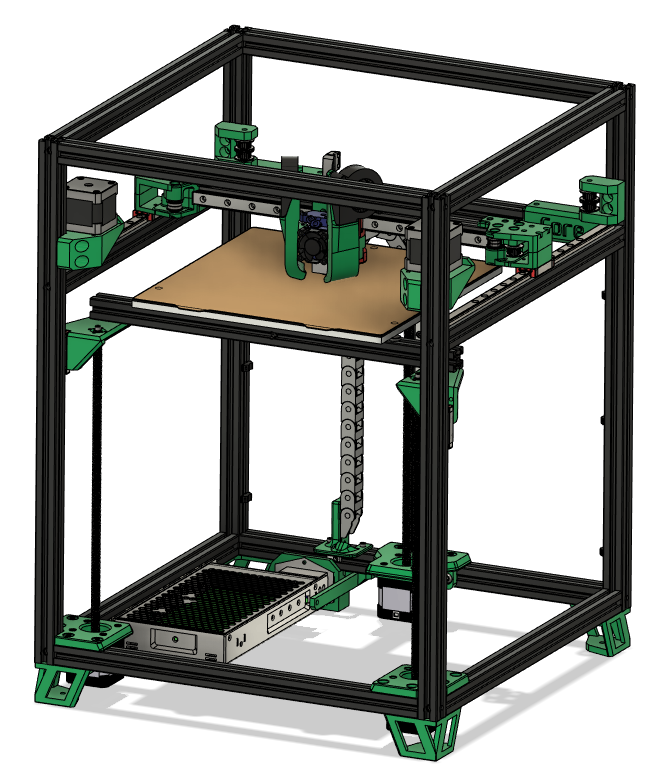

# SimpleCore MK1
This is the official MK1 SimpleCore Github!

Features:

- Uses Voron Trident Frame
- Mantis Toolhead
- Triple Z motors
- Fully enclosable design
- Klicky Probe Support

BOM 250mm Size
https://docs.google.com/spreadsheets/d/1itUaLOwN8U-ldt7ZHBf0SfRjgWGmMog7KDNe5z_rCVY/edit#gid=0

My Patreon
https://www.patreon.com/rolohaun

Build Series
https://www.youtube.com/watch?v=_4NIc2eGpA0&list=PLypdl9fsWkKdIIs_hwjbh7VXXiUZjz-F_