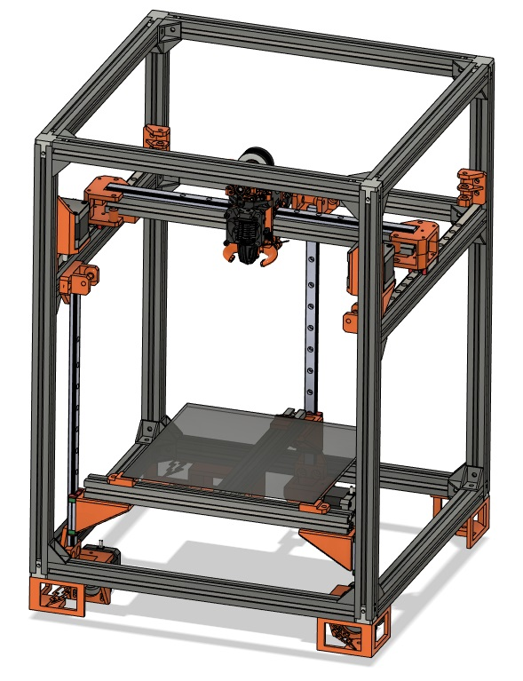

# SimpleCore
Welcome to the DIY 3D Printer called SimpleCore!

SimpleCore 200

PLEASE NOTE THIS PRINTER IS A WORK IN PROGRESS! ( I am getting ready to release MK1 which will be the offical completed release )

The goal of this printer is to make a very simple DIY corexy 3D printer than can be built by anyone for the cheapest possible.

Features:

- Simple frame using standard size 2020 extrusions, no drilling or tapping
- EVA 2.4 Toolhead support, build the printer you want
- Triple belted Z motors
- Fully enclosable design
- Klicky Probe Support

BOM for 200x200 Build area and 330x330 Build area! (Work in progress!)
https://docs.google.com/spreadsheets/d/1O3hkrCF_OMRDucAhxMPro0IfUh7aCPbqEiQB7Yf0kRw/edit#gid=0

My Discord
https://discord.gg/Dx3qwQN2DS

Find it on Youtube
https://www.youtube.com/watch?v=aPkX0bcwmN4

Support me on Patreon
https://www.patreon.com/rolohaun

EVA 2.4 Here
https://2.eva-3d.page/

Get Klicky Probe Here
https://github.com/jlas1/Klicky-Probe